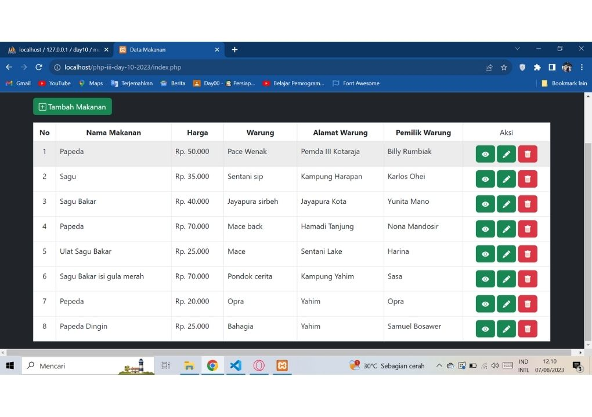
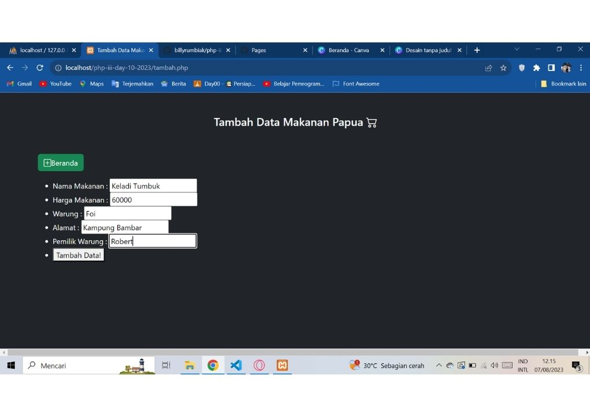
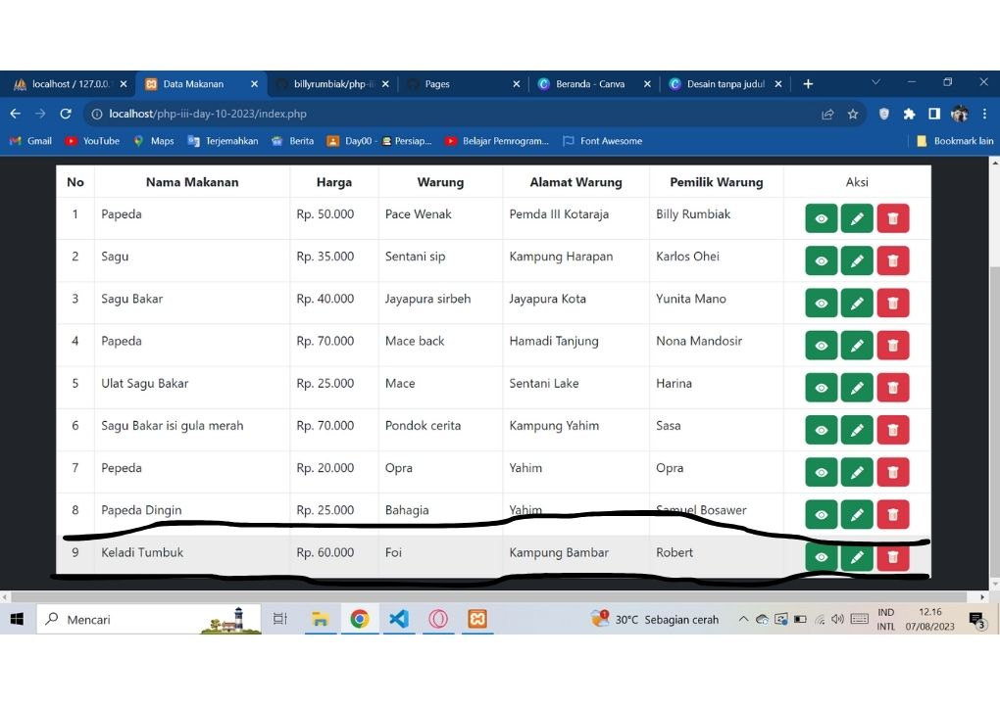
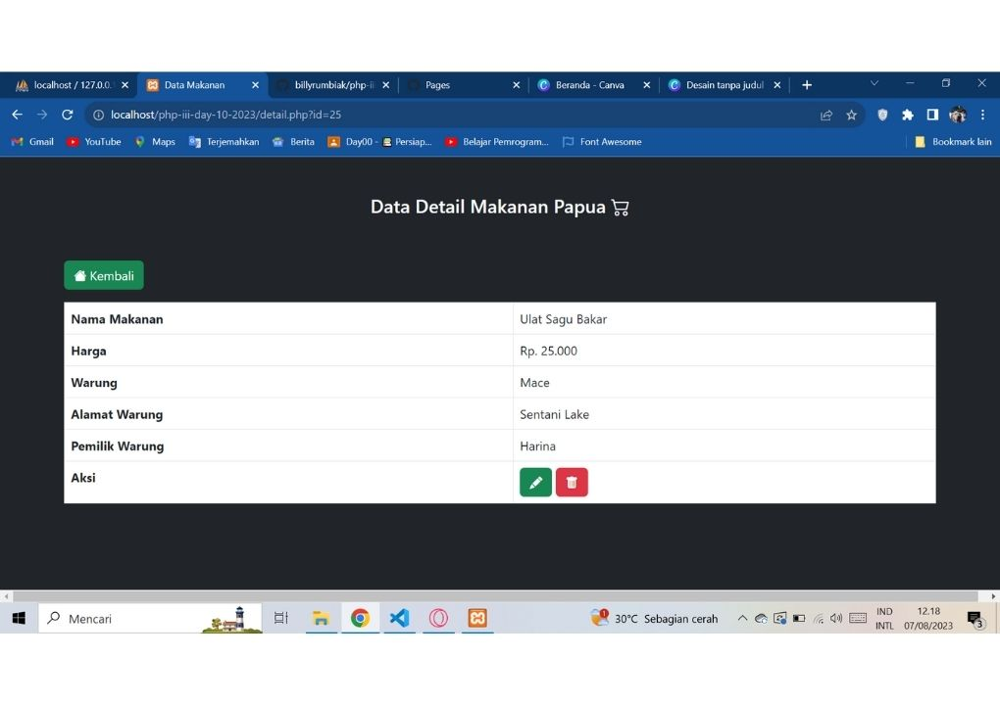
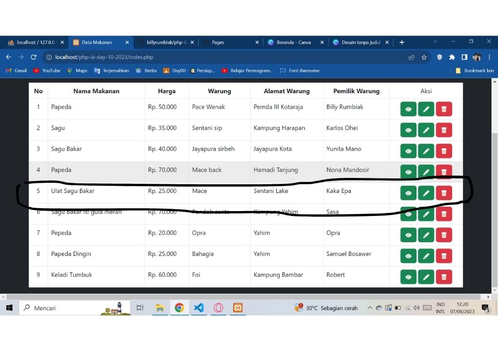
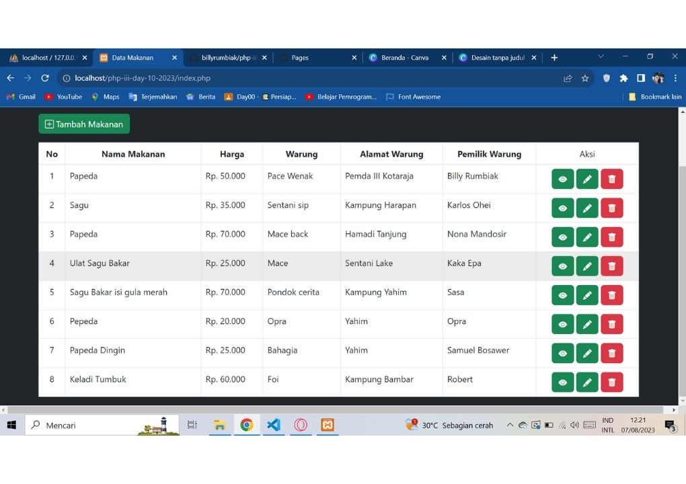

# php-iii-day-10-2023

Menampilkan Data Dari Database

## Query tambah data

    INSERT INTO makanan VALUES ('', '$nama_makanan', '$harga_makanan', '$warung', '$alamat', '$pemilik_warung')

## Query tampilkan semua data dari table

    SELECT * FROM `makanan`

## Query menampilkan satu data berdasarkan id

    "SELECT * FROM `makanan` WHERE id_makanan = $id";

## Query menambahkan makanan

    UPDATE makanan SET id_makanan = '$id_makanan', nama_makanan = '$nama_makanan', harga_makanan = '$harga_makanan', warung = '$warung', alamat = '$alamat', pemilik_warung = '$pemilik_warung' WHERE id_makanan = $id_makanan

## Query menghapus

    DELETE FROM `makanan` WHERE 0

## Tampilan CRUD

### Tabel Data Makanan

### Fungsi Tambah Data Makanan

### Berhasil Tambah Data Makanan

### Detail Data Makanan

### Edit Data Makanan

### Berhasil Edit Data Makanan

### Berhasil Hapus Data Makanan

